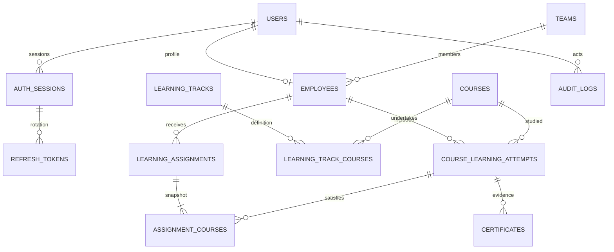

# Phase 1 architecture and relational model

Browser → same-origin Next.js → FastAPI routes/dependencies → application services → repositories/SQLAlchemy → PostgreSQL. Certificate services use `StorageService` → private S3-compatible object storage. Redis provides shared login/refresh throttling.

## Relationships

An assignment has exactly one course or track target. Assignment items capture track membership/order. Track edits affect future assignments only. Assignment status is derived from included attempts; completion date is the latest completed course date when all items are completed. Overdue is derived from unfinished items and organization-local calendar dates.

An employee has at most one non-retired unfinished attempt per course. Direct and track assignments reuse this attempt; progress, completion and evidence are stored once. Completed attempts are not automatically reused. New assignments after completion create new attempts. Different assignment deadlines remain on assignments; consolidated learning displays the earliest active deadline.

Assignment items include employee/course identifiers for composite foreign keys that enforce identity consistency. No completion data is copied into assignment items. Certificates reference attempts, not one arbitrarily selected assignment.

Cancelling all assignment contexts retires an unfinished attempt. History remains. Managers can reopen completion with a reason only when no competing active attempt exists. Reopening revokes the old evidence so it must be reaffirmed. Manager corrections and employee changes write audit entries within the same database transaction.

Employee updates must satisfy all active assignment policies. Managers may correct learning but also need valid dates and required evidence. Completing requires a date between the attempt start date and today. All timestamps are UTC; calendar dates use `ORGANIZATION_TIMEZONE`.

## Metrics

Assignments count containers. Assigned/completed/in-progress/enrolled/pending counts refer to distinct course attempts. Overdue overlaps statuses. Completion percentage is null with zero learning. Dashboard active employees excludes inactive accounts; outstanding active learning remains visible until its assignments are cancelled. Capability views show learning attention signals, not judgments of competence.

## Extensibility

Future modules can call existing service operations and add external-identity mappings/provenance through migrations. No imports, staging, processors or Phase 2 routes exist. Object storage adapters are independent of the selected provider. Authentication users remain separate from employee profiles.

## Implementation stages

1. Foundation: folder structure, configuration, Docker, models and Alembic.
2. Identity: Argon2, sessions, JWT, token rotation, RBAC/ownership, bootstrap CLI.
3. Catalog: employees, courses, teams and ordered tracks.
4. Learning: assignments, captured track courses, shared attempts and progress.
5. Evidence: bounded validation, private object storage and authorized retrieval.
6. Reporting: personal/team dashboards, capability signals and audit history.
7. Verification: backend workflow/security tests, TypeScript/build and migration checks.

Implementation files are the complete code deliverable; the README contains exact commands for each runnable stage.
